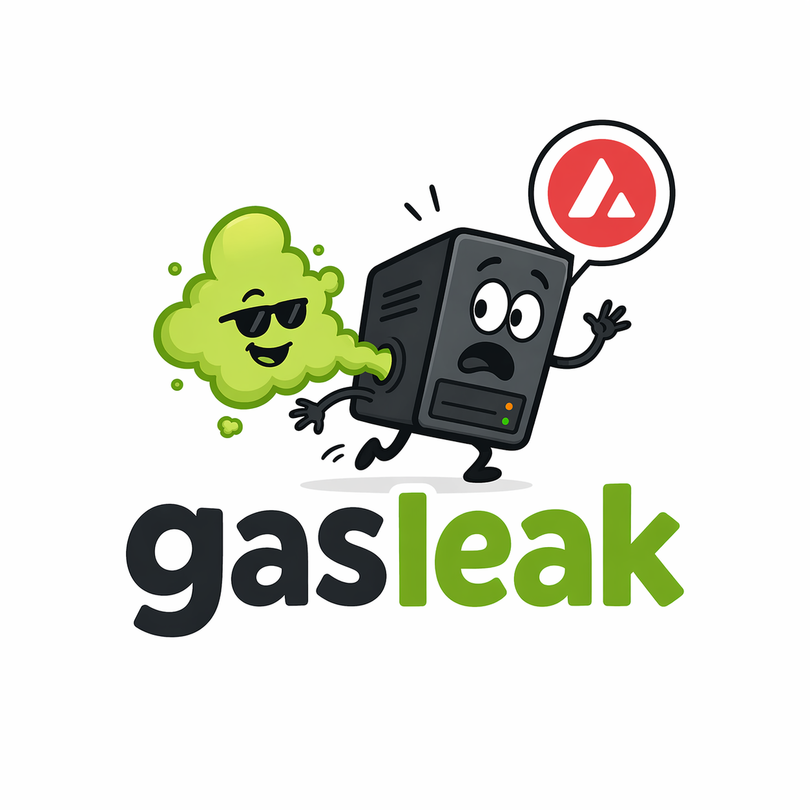

<p align="center">
  
</p>

<h1 align="center">gasleak</h1>

<p align="center"><b>Your personal assistant for managing stale EC2 instances.</b></p>

<p align="center">
  <a href="#quick-start"></a>
  
  
  
</p>

<p align="center">
  <a href="#install">Install</a> ·
  <a href="#quick-start">Quick start</a> ·
  <a href="#usage">Usage</a> ·
  <a href="#how-it-decides">How it decides</a> ·
  <a href="#slack-integration">Slack</a> ·
  <a href="#configuration">Configuration</a> ·
  <a href="#operations">Operations</a>
</p>

---

`gasleak` is a Rust CLI that scans running EC2 instances, attributes a real cost (compute **+ EBS**) to each, reads CloudWatch to see which ones actually do work, and applies a small rule engine to flag the stale / oversized / tag-missing / long-lived boxes you forgot about. It exits with a severity code so a cron driver can route the output without parsing it.

Today gasleak is read-only — it reports, it doesn't remediate. Automated actions (stop / terminate / tag rewrite) are planned but not yet shipped.

---

## Features

- **Three-layer decision.** Controller-owned (EKS / ASG / Spot) is skipped. Tagged instances follow their own `ExpiresAt`. Everything else is judged on CPU activity with a 30-day lookback.
- **Real cost per instance.** Compute + EBS capacity + provisioned IOPS + gp3 throughput, rolled into one `cost_usd`. A stopped box with a 2 TB gp3 volume finally shows its true spend.
- **Fleet burn rate.** Every `list` / `stale` run reports `$/mo · $/hr · $/yr`. `stale` also prints a **potential-savings** line covering just the flagged rows.
- **Multi-region.** `--all-regions` enumerates via `DescribeRegions` and fans out at concurrency 8.
- **Slack reports.** `--slack` / `--slack-only` post a Block Kit message with severity-colored attachments, AWS Console buttons per row, and a progressive-disclosure rollup for long Low-severity tails.
- **Pipe-safe JSON.** `--json` emits a stable schema for `jq` and cron pipelines. Tracing stays on stderr.
- **Cron-first exit codes.** `0` clean · `1` any Medium · `2` any High · `3` Slack POST failed.

---

## Install

```sh
# From a clone
cargo install --path .

# Or straight from GitHub
cargo install --git https://github.com/powerslider/gasleak
```

Both paths drop the `gasleak` binary in `~/.cargo/bin`. Make sure that's on your `$PATH`.

Prefer a local build without installing?

```sh
cargo build --release      # target/release/gasleak
```

Pre-built binaries and a Homebrew tap are on the roadmap.

---

## Quick start

```sh
# 1. AWS creds (any of the standard SDK paths work)
export AWS_REGION=us-east-1
export AWS_PROFILE=<your-profile>

# 2. Run
gasleak stale               # severity-sorted triage table
gasleak list                # full inventory + fleet burn rate
gasleak explain i-0abc123   # full rule trace for one instance
```

Add `--json` for structured output, `--all-regions` for multi-region scans, or `--slack` to post the same data to a Slack channel (see [Slack integration](#slack-integration)).

---

## Usage

### `gasleak stale` — triage

Runs every rule, sorts by severity, and exits with `0/1/2`.

```
sev   instance_id          type         cost_usd    total_age      last_active   p95_cpu  launched_by               verdicts
----  -------------------  -----------  ----------  -------------  ------------  -------  ------------------------  ------------------------------------------------------------
HIGH  i-0a297863a35b12ebc  c5.4xlarge   $10,643.14  392d 18h 4m    >30d ago      0.1 %    austin                    inactive(>30d); underutilized(p95=0.1%); long_lived(392d); non_compliant
HIGH  i-0c5cb6fc3747b6233  m5.4xlarge   $1,519.82   72d 2h 25m     >30d ago      0.5 %    state                     inactive(>30d); underutilized(p95=0.5%); non_compliant
MED   i-078f873c9dc0331e6  c5.4xlarge   $9,416.27   433d 17h 47m   27d 7h ago    0.9 %    austin                    inactive(27d); underutilized(p95=0.9%); long_lived
...

25 flagged / 36 scanned, worst severity: HIGH
Fleet burn rate: $31,024.33/mo  |  flagged: $7,801.43/mo  (potential savings from cleanup)
```

`managed` rows (EKS / ASG / Spot) are hidden — controllers own their lifecycle.

### `gasleak list` — inventory

All running instances, sorted by cost desc. Same cost column as `stale` (compute + EBS). Fleet burn rate in the footer.

### `gasleak explain <id>` — one-instance drill-down

Full tag dump, parsed contract, CPU summary, per-volume storage breakdown, and a rule-by-rule trace showing *why* each rule fired or skipped. Works on stopped instances too. Always exits 0.

### JSON output

Every subcommand accepts `--json`. The schemas are stable, borrow from in-memory types (no cloning on the output path), and always include region info and burn rate:

```sh
gasleak --json stale | jq '.summary'
```

```json
{
  "scanned": 36,
  "flagged": 25,
  "worst_severity": "high",
  "fleet_burn_rate":   { "hour": 42.50, "day": 1020.0, "month": 31024.33, "year": 372292.0 },
  "flagged_burn_rate": { "hour": 10.69, "day":  256.5, "month":  7801.43, "year":  93617.2 }
}
```

---

## How it decides

There is no single "is this stale" test. Different instances are stale for different reasons, and the reason needs to drive routing.

### Three layers (higher pre-empts)

1. **Exemption.** EKS / ASG / Spot tag → verdict `managed` (Info, hidden from `stale`).
2. **Declarative — tags decide.** If `ExpiresAt` is set:
   - `ExpiresAt < now` → `Expired` (**High**).
   - `now < ExpiresAt ≤ now + 72h` → `ExpiringSoon` (**Medium**).
3. **CPU evidence.** *Vetoed when `ExpiresAt` is in the future.* Requires ≥ 168 hourly CloudWatch samples.
   - `Inactive` — severity steps on time since `last_active`: `<7d` skip · `7–14d` Low · `14–30d` Medium · `≥30d or no active hour` **High**.
   - `Underutilized` — p95 CPU < 2 % over the 30-day window → **Low**.

Two warnings run in parallel, always Low unless noted:

- `LongLived` — `total_age ≥ 90 d`.
- `NonCompliant` — required tag missing. **High** when `ManagedBy=gasleak/*` is present but other tags are stripped (*tampered*).

### Exit codes

| Code | Meaning                     | Trigger                          |
|------|-----------------------------|----------------------------------|
| `0`  | Nothing actionable          | Only Info or Low verdicts        |
| `1`  | Nudge                       | Any Medium verdict               |
| `2`  | Page                        | Any High verdict                 |
| `3`  | Slack POST failed           | Only with `--slack-only`         |

---

## Metrics

### Two ages and one activity signal

| Metric          | Source                                                    | Resets when                   | Answers                      |
|-----------------|-----------------------------------------------------------|-------------------------------|------------------------------|
| `total_age`     | Root EBS volume `AttachTime` (falls back to `LaunchTime`) | Instance re-created           | *How long around?*           |
| `last_uptime`   | `DescribeInstances.LaunchTime`                            | Every stop/start              | *When did it last start?*    |
| `last_active`   | Most recent hour with **peak CPU ≥ 5 %** in 30-day window | CPU activity                  | *When did it do real work?*  |

When `total_age` and `last_uptime` diverge, the instance has been stopped and restarted. Sort key for `stale` is `total_age`.

`last_active` renders as:

| Display     | Meaning                                                                 |
|-------------|-------------------------------------------------------------------------|
| `Xd Yh ago` | At least one active hour in the window                                  |
| `>30d ago`  | Window had zero active hours (matches `inactive_high_days`)             |
| `no data`   | CloudWatch returned zero samples (agent missing, instance too new)      |
| `-`         | CloudWatch call itself failed (a warning is logged)                     |

### CPU rules answer different questions

- `inactive` — *"should we consider killing this box?"* Driven by time since `last_active`.
- `underutilized` — *"is this box oversized?"* Driven by p95 CPU over the 30-day window.

Both can fire on the same instance. A recently busy box with p95 = 1 % suggests a smaller instance type, not termination.

### Samples gate (`168`)

`inactive` refuses to fire unless CloudWatch returned ≥ 168 hourly points. Covers two concerns: the instance is too new to judge (< 7 days), or the agent is missing / flaky (sparse data should never read as idleness).

---

## The tagging contract

Four tags, one lever (`ExpiresAt`).

| Tag          | Example                             | Purpose                                                                      |
|--------------|-------------------------------------|------------------------------------------------------------------------------|
| `ManagedBy`  | `gasleak/0.1.0`                     | Marks the instance as contract-compliant. Starts-with match on `gasleak/`.   |
| `Owner`      | `arn:aws:iam::123:user/tsvetan`     | Attribution. Auto-stamped by `gasleak launch` (not yet shipped).             |
| `OwnerSlack` | `@tsvetan` or `#team-payments`      | Routing target for the Slack reporter.                                       |
| `ExpiresAt`  | `2026-05-01T00:00:00Z`              | Declared end-of-life. RFC 3339, must be in the future.                       |

**The confirmation loop.** Launch with `ExpiresAt=now+7d`. At day 5, `expiring_soon` fires — Slack pings `OwnerSlack` with recent CPU context. Owner either runs `gasleak extend <id> --for 14d` (coming soon) or ignores it; `expired` fires on day 7 and the cron pages. The only way to stop the nagging is to commit to a new deadline.

---

## Slack integration

`--slack` posts a Block Kit message in addition to stdout. `--slack-only` suppresses stdout (for cron).

```sh
# One-time: put your webhook in gasleak.toml
cat > ~/.config/gasleak/gasleak.toml <<'EOF'
[slack]
webhook_url      = "https://hooks.slack.com/services/..."
max_flagged_rows = 10
EOF
chmod 600 ~/.config/gasleak/gasleak.toml

# Post to Slack
gasleak --slack-only stale
```

The message carries:

- Severity-emoji header (`🚨` High · `🔶` Medium · `🟡` Low · `🟢` clean).
- **Money block** above the fold: `$X/mo potential savings · $Y/mo fleet burn rate`.
- One attachment per severity (colored left bar) with full-row sections.
- Per-row **AWS Console** button that deep-links into the EC2 detail page.
- Low-severity overflow compresses into a single rollup block. High / Medium **never** compress.
- Footer with version, region, scan timestamp (renders as *"2 min ago"*), and total instance count.

Webhook URL is read from `[slack] webhook_url` or `$GASLEAK_SLACK_WEBHOOK` — never accepted as a CLI arg, since CLI args end up in shell history and `ps -e`.

---

## Configuration

### Config file precedence

1. `--config <PATH>` CLI flag — explicit; errors on missing.
2. `$GASLEAK_CONFIG` env var — explicit; errors on missing.
3. `$HOME/.config/gasleak/gasleak.toml` — default; silently falls back to built-in defaults.

A file that exists but fails to parse is always a hard error. Unknown keys are ignored for forward compatibility.

### All keys

```toml
[inactive]
low_days    = 7      # below this, the rule does not fire
medium_days = 14     # at/above this, severity = Medium
high_days   = 30     # at/above this, severity = High. Also the CloudWatch lookback window.
min_samples = 168    # data-quality floor (7 days of hourly data)

[underutilized]
p95_threshold_pct = 2.0    # below this, fires a Low warning

[long_lived]
age_days = 90              # at/above this, fires a Low warning

[warn]
window_hours = 72          # lead-time before ExpiresAt for `expiring_soon`

[slack]
webhook_url              = "https://hooks.slack.com/services/..."  # required for --slack
max_flagged_rows         = 10                                      # Low-severity cap before rollup
report_url               = "https://runbook.example.com/gasleak"   # optional "Open full report" button
mention_owner_at_severity = "high"                                 # low|medium|high|never
```

The CLI never gains flags for these tunables. Per-invocation overrides go in a one-off TOML pointed at by `GASLEAK_CONFIG`.

### Global flags

| Flag                           | Effect                                                                              |
|--------------------------------|-------------------------------------------------------------------------------------|
| `--config <PATH>`              | Override the config-file path.                                                      |
| `--json`                       | Emit structured JSON on stdout. Tracing stays on stderr (pipe-safe).                |
| `--all-regions`                | Discover regions via `DescribeRegions` and fan out.                                 |
| `--slack` / `--slack-only`     | Post to Slack (in addition to / instead of stdout).                                 |
| `--regenerate-pricing-table`   | Refresh `ec2_prices.json` from the AWS pricing offer and exit.                      |
| `-v` / `-vv`                   | `-v` = info logs, `-vv` = debug logs (on stderr).                                   |

---

## Operations

### IAM policy

Minimum for `list` / `stale` / `explain`:

```json
{
  "Version": "2012-10-17",
  "Statement": [{
    "Effect": "Allow",
    "Action": [
      "ec2:DescribeInstances",
      "ec2:DescribeVolumes",
      "ec2:DescribeRegions",
      "cloudwatch:GetMetricData"
    ],
    "Resource": "*"
  }]
}
```

- `ec2:DescribeInstances` — the scan itself.
- `ec2:DescribeVolumes` — EBS cost breakdown. Missing this soft-fails: `cost_usd` falls back to compute-only and a warning is logged.
- `ec2:DescribeRegions` — only needed for `--all-regions`.
- `cloudwatch:GetMetricData` — CPU columns and the `inactive` / `underutilized` rules.

### Cron driver

```sh
#!/bin/sh
export AWS_PROFILE=gasleak-reader
export AWS_REGION=us-east-1

gasleak --slack-only --all-regions stale
case $? in
  0) ;;                                          # silent
  1) ;;                                          # Medium, Slack handles it
  2) logger -t gasleak "HIGH severity — see Slack" ;;
  3) logger -t gasleak "Slack post failed; re-run manually" ;;
esac
```

### Build

```sh
cargo build               # debug: target/debug/gasleak
cargo build --release     # release: target/release/gasleak
cargo test                # 99 unit + 4 integration tests
cargo clippy --all-targets -- -D warnings
```

### Troubleshooting

- **`RequestExpired` / `credential provider not enabled`** — creds missing or expired. Re-auth (`aws sso login --profile <profile>`) and re-export env vars.
- **`Error: no AWS region configured`** — set `AWS_REGION` or export an `AWS_PROFILE` whose config declares a region.
- **`Slack is enabled but no webhook URL was resolved`** — add `[slack] webhook_url` to `gasleak.toml`, or set `$GASLEAK_SLACK_WEBHOOK`. Never pass the URL as a flag.
- **Nothing shows up** — single-region scan respects `AWS_REGION`. For a full sweep, use `--all-regions`.
- **Slack returned `ok` but nothing arrived** — webhook is pinned to a channel you can't see or which was archived. Re-bind in Slack app settings.

---

## Status

**Shipped:**

- `list`, `stale`, `explain` — all with `--json` and `--slack` variants.
- Compute + EBS cost attribution. Fleet and flagged burn rates.
- Multi-region (`--all-regions`).
- Severity-driven exit codes for cron.
- Slack Block Kit reporting with severity-colored attachments.
- Pricing-table refresh (`--regenerate-pricing-table`).
- 99 unit tests + 4 `wiremock` integration tests.

**Not yet:**

- `gasleak launch` — contract-enforcing instance creation. Until this lands, tagging is on whoever calls `RunInstances`.
- `gasleak extend <id> --for <duration>` — confirmation mechanism that rewrites `ExpiresAt`.
- Remediation subcommands (stop / terminate / tag rewrite). gasleak is read-only today; automated actions are on the roadmap.
- CSV output and TTY-aware format selection.
- AVAX cost column (USD is shipped).
- `long_stopped` verdict for stopped instances accruing EBS.

---

## License

Dual-licensed under [MIT](LICENSE-MIT) or [Apache 2.0](LICENSE-APACHE) at your option.
